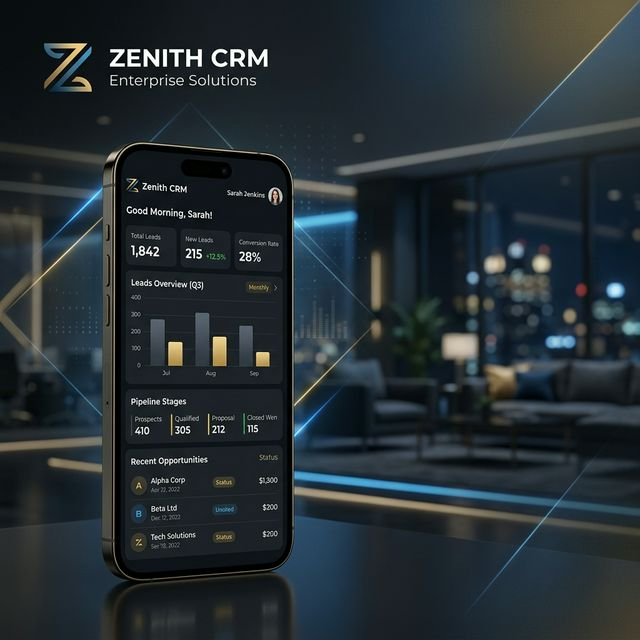

# CRM Pro 🚀



## Overview
**CRM Pro** is a comprehensive, high-performance Customer Relationship Management solution designed to empower sales teams and streamline business operations. Built with the latest Flutter technology and supported by a robust Firebase backend, it provides a seamless experience for managing leads, deals, tasks, and reports on the go.

---

## ✨ Key Features

- **📊 Comprehensive Dashboard**: Get real-time insights into your sales pipeline and key performance indicators.
- **📁 Advanced Lead Management**: Track leads from initial contact to conversion with ease.
- **🤝 Deal Tracking**: Manage your sales funnel effectively with intuitive deal stages and status updates.
- **✉️ Enquiry & Referral Systems**: Seamlessly handle new enquiries and professional referrals within the app.
- **📈 Professional Reporting**: Generate detailed reports to visualize growth and identify trends.
- **🔔 Real-time Notifications**: Stay updated with push notifications for every important event and follow-up.
- **🔐 Enterprise-grade Security**: Secure your data with Biometric authentication (Fingerprint/Face ID) and social authentication (Google & Apple).
- **📅 Smart Follow-ups**: Never miss a meeting or call with our intelligent scheduling and follow-up system.

---

## 🛠️ Technology Stack

| Category | Technology |
| :--- | :--- |
| **Framework** | [Flutter](https://flutter.dev/) (v3.10.3+) |
| **Language** | [Dart](https://dart.dev/) |
| **Backend** | [Firebase](https://firebase.google.com/) (Auth, Firestore, Cloud Messaging) |
| **State Management** | [Provider](https://pub.dev/packages/provider) |
| **Authentication** | Google Sign-In, Apple Sign-In, Biometric (`local_auth`) |
| **UI/UX** | Custom Design with `flutter_screenutil` for responsiveness |

---

## 📸 Screenshots

<p align="center">
  
</p>

---

## 🚀 Getting Started

To get a local copy up and running, follow these simple steps.

### Prerequisites
* Flutter SDK (3.10.3 or higher)
* Android Studio / VS Code
* Firebase account and a project configured for the app

### Installation

1. **Clone the repo**
   ```sh
   git clone https://github.com/yourusername/crm.git
   ```

2. **Install dependencies**
   ```sh
   flutter pub get
   ```

3. **Configure Firebase**
   - Add your `google-services.json` (for Android) and `GoogleService-Info.plist` (for iOS) into the respective folders.
   - Run `flutterfire configure` to generate the `firebase_options.dart` file.

4. **Run the app**
   ```sh
   flutter run
   ```

---

## 📁 Project Structure

```text
lib/
├── Models/        # Data models for the business logic
├── Screens/       # UI screens (Home, Leads, Deals, etc.)
├── Services/      # Business logic and external API integrations
├── Widgets/       # Reusable UI components
├── main.dart      # Application entry point
└── firebase_options.dart # Firebase configuration
```

---

## 📄 License
Distributed under the MIT License. See `LICENSE` for more information.

## 📧 Contact
Your Name - your.email@example.com

Project Link: [https://github.com/yourusername/crm](https://github.com/yourusername/crm)

---
<p align="center">Made with ❤️ for modern businesses</p>
